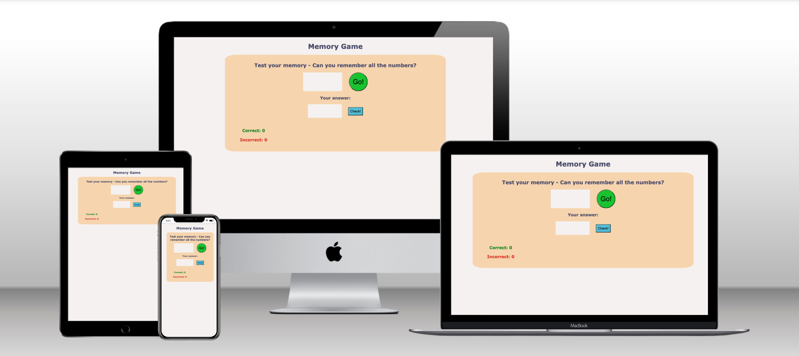
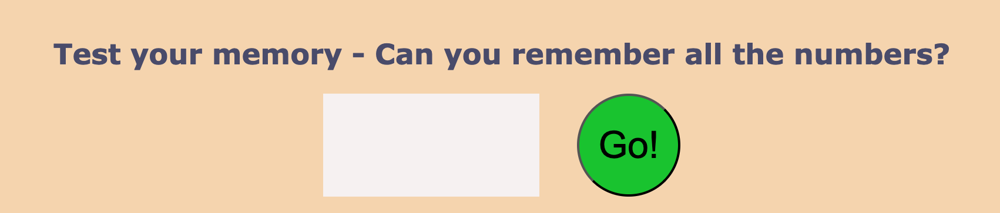
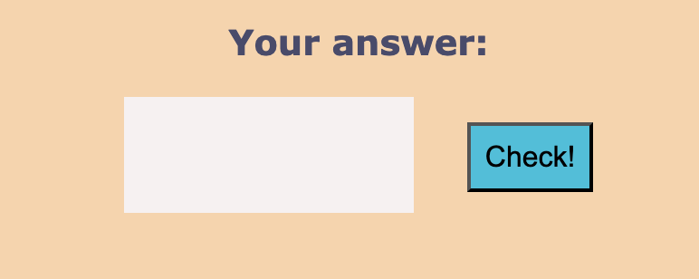
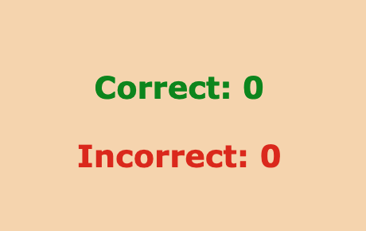
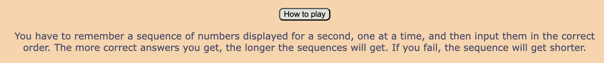
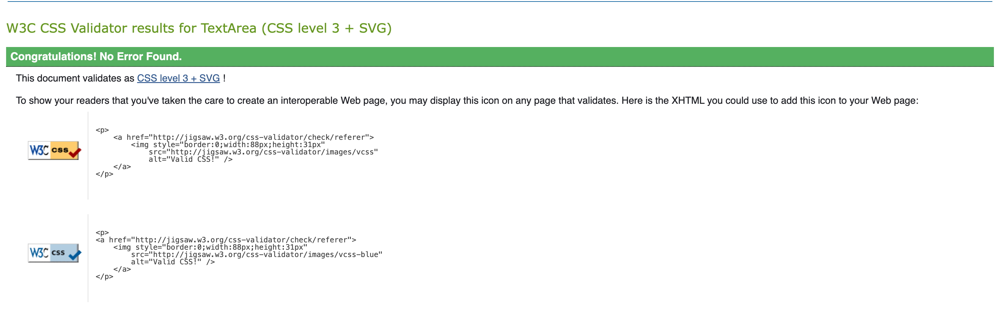
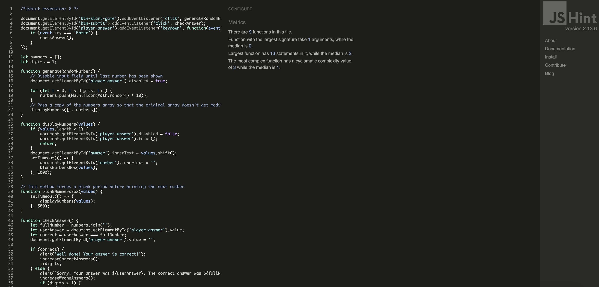
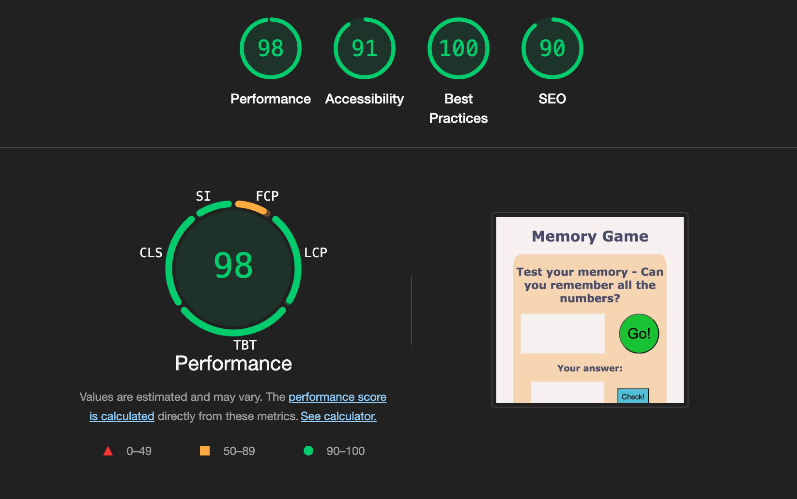

# Memory game

This ultimate number memory challenge will put your brain to the test! In this simple yet addictive game, players must remember a sequence of numbers displayed for a second, one at a time, and then input them in the correct order. As the player gets more correct answers, the sequences get longer and more complex, pushing your memory to new limits. Similarly, the sequences will get shorter if the player fails to give the right answer.

This game is perfect for casual gamers, puzzle lovers, and anyone looking to sharpen their mind. Exercising your memory has been shown to provide significant cognitive benefits across all age groups. For children and adolescents, memory training enhances learning abilities, improves academic performance, and strengthens problem-solving skills. In adults, regular memory exercises can improve focus, increase productivity, and boost overall cognitive function. For older adults, studies indicate that engaging in memory activities can slow cognitive decline, reduce the risk of dementia, and improve quality of life. In fact, research shows that consistent cognitive challenges can increase brain plasticity, which helps maintain mental agility throughout life. You can play for as long or as short as you would like, but even if it is just a few minutes every day, you will keep your brain in great shape!

## Features

### Existing features

- __Game area__

    - In this section the user will be able to initiate the game by clicking on the 'Go!' button.
    - When the game starts, the first sequence of numbers will appear (one at a time) on the numbers box. It will only show for 1 second and then disappear. The first sequence only contains one number.
    - The lenght of the sequences will increase as the player gets more correct answers, and will decrease as they get a wrong answer. This is to encourage the users and keep them engaged with the game. The game fits everyone's ability!
    - To help with engagement there is also a catchy sentence at the top.

- __Player answer area__
    - In this area, the player can introduce the number as they remember it and get this number checked against the real number generated by the app. 
    - The input field is disabled while the number is still showing on the number box of the game area. Players will not be allowed to start typing the numbers until the whole sequence is finished. This ensures that the player exercises their memory.
    - Once the number sequence is finished, the input field will get focused, saving the player one click. Similarly, once the player is ready to check if their number is correct, they will be able to do so by either clicking on the 'Check!' button or pressing the Enter key.

   

- __Score area__
    - In this area the player can keep track of the number of correct and incorrect answers they had.
    - This is colour-coded to improve user experience.

    

 - __Instructions button__
    - This button toggles the view of a short explanation about how to play the game

    

### Features left to implement

- Different play modes based on ability: The player would need to type the numbers they saw but backwards, or ordering before typing them.
- Multiplayer game: Players would be able to save their current streaks and highest scores and compete against other players in the ranking. 

## Testing

This page is responsive and it will look good on different browsers and devices of all sizes, allowing the player to have a great user experience.
The code and the site have been through numerous validators, obtaining very good results (see next section for details).

### Validator testing

- HTML
    - Passed official W3C HTML validator without any errors. [HTML validator](https://validator.w3.org/nu/?doc=https%3A%2F%2Fmariluzcodeinstitute.github.io%2Fmemory-game%2F)

    

- CSS
    - Passed official W3C CSS validator without any errors. [CSS validator](https://jigsaw.w3.org/css-validator/validator?uri=https%3A%2F%2Fmariluzcodeinstitute.github.io%2Fmemory-game%2F&profile=css3svg&usermedium=all&warning=1&vextwarning=&lang=en)

    

- JS
    - Passed the JSHint validator without errors. 

    

- Lighthouse
    - This site achieves high percentages on all the tests performed by Lighthouse.

    

### Unfixed bugs

There are no bugs that needs fixing at the time this README is being written.

## Deployment

This site is deployed to GitHub pages. The steps that were followed for its deployment are:
  1. In the GitHub repository, navigate to the settings tab
  2. On the left-hand sidebar, in the Code and automation section, select Pages.
  3. Set Source to 'Deploy from Branch', select Main Branch and set Folder to /(root)
  4. Click Save (it might take a few minutes for the build to finish)

To deploy this project locally using Gitpod, simply run `python3 -m http.server` on the Gitpod terminal and click on 'Open Browser'.

Alternativelly you can clon the repo into your machine and open the html file with your chosen browser.

## Technologies

The main languages used to build this app are HTML, CSS and JavaScript. The code has been implemented using GitPod and it lives on a [GitHub repository](https://github.com/MariluzCodeInstitute/memory-game)

## Credits

### Content

The content of this app has been created by the author based on one of the memory tasks from the IQ test [Wechsler Adult Intelligence Scale - WAIS](https://en.wikipedia.org/wiki/Wechsler_Adult_Intelligence_Scale)

### Code

Some online support has been needed while building this app:

- Some tips on CSS come from the [CSS MDN Docs](https://developer.mozilla.org/en-US/docs/Web/CSS)
- Support with JavaScript comes from [JS MDN Docs](https://developer.mozilla.org/en-US/docs/Web/JavaScript) and StackOverflow
- The score area implementation was inspired on the [Love Maths project](https://github.com/Code-Institute-Solutions/love-maths-2.0-sourcecode)

